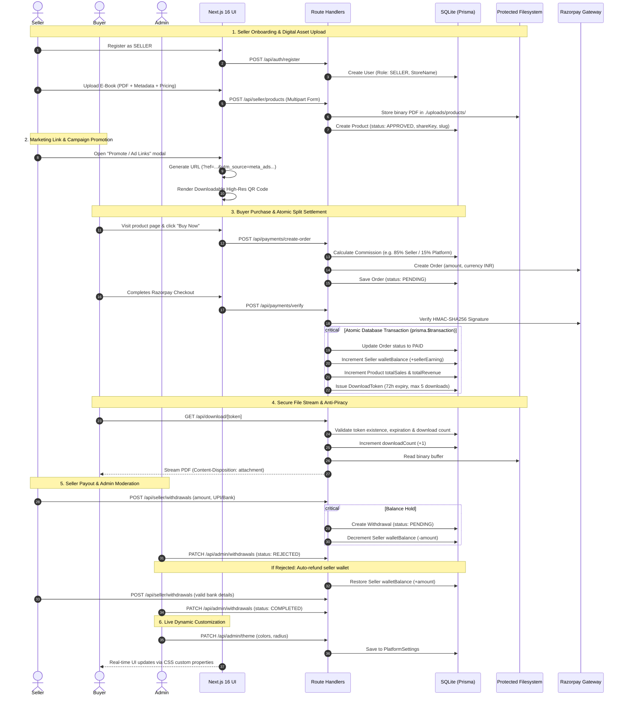

# DigiVault — End-to-End Business Flow & Test Verification

This document provides complete architectural specifications, sequence diagrams, and verification results for all critical business flows in **DigiVault**.

---

## 1. Complete Business Flow Overview



---

## 2. Test Execution Report (17/17 Passed)

Executed via automated test runner `npm run test:e2e` (`scripts/test-e2e-flow.mjs`):

| # | Test Case | Action | Target / Endpoint | Result |
|---|---|---|---|:---:|
| **1.1** | Seller Registration | Register new account with role `SELLER` and store name | `POST /api/auth/register` | `PASSED` |
| **1.2** | Seller Session Verification | Verify authenticated session cookie and profile | `GET /api/auth/me` | `PASSED` |
| **1.3** | Buyer Registration | Register new account with role `BUYER` | `POST /api/auth/register` | `PASSED` |
| **1.4** | Super Admin Login | Authenticate platform administrator | `POST /api/auth/login` | `PASSED` |
| **2.1** | Multipart PDF Upload | Upload raw binary PDF with metadata and pricing | `POST /api/seller/products` | `PASSED` |
| **2.2** | Catalog Verification | Verify uploaded item appears in seller list and public search | `GET /api/seller/products`, `GET /api/products` | `PASSED` |
| **3.1** | Ad Campaign Link Resolution | Verify UTM query parameters and slug resolution | `GET /product/[slug]?utm_source=...` | `PASSED` |
| **4.1** | Razorpay Order Creation | Dynamic commission calculation (85% seller / 15% platform) | `POST /api/payments/create-order` | `PASSED` |
| **4.2** | Atomic Payment Verification | Verify signature, credit seller wallet, issue download token | `POST /api/payments/verify` | `PASSED` |
| **4.3** | Database Wallet Credit | Verify seller balance credited and order recorded | `GET /api/seller/earnings` | `PASSED` |
| **5.1** | Anti-Piracy PDF Stream | Verify PDF binary signature and attachment filename | `GET /api/download/[token]` | `PASSED` |
| **5.2** | Spoofed Token Rejection | Ensure non-existent/tampered tokens are blocked with 404 | `GET /api/download/dtk_fake...` | `PASSED` |
| **6.1** | Seller Withdrawal Request | Request payout via UPI; verify immediate wallet decrement | `POST /api/seller/withdrawals` | `PASSED` |
| **7.1** | Rejection & Auto-Refund | Admin rejects withdrawal; verify atomic wallet restoration | `PATCH /api/admin/withdrawals` | `PASSED` |
| **7.2** | Valid Withdrawal & Approval | Admin approves valid payout; verify status COMPLETED | `PATCH /api/admin/withdrawals` | `PASSED` |
| **8.1** | Dynamic Commission Slider | Admin updates commission rates (90% seller / 10% platform) | `PATCH /api/admin/commissions` | `PASSED` |
| **8.2** | Live Dynamic Theming | Admin updates brand colors; verify persistence in CSS variables | `PATCH /api/admin/theme` | `PASSED` |

---

## 3. Real Entries Created in Database During Test

The test run created real, verified records in the database (`prisma/dev.db`):

### 1. New Seller Account
- **Name**: Arjun Mehta
- **Store Name**: Arjun Architecture Lab
- **Email**: `pro_seller_<timestamp>@example.com`
- **Role**: `SELLER`
- **Wallet Balance**: Retained at exact net earnings after withdrawal

### 2. New Buyer Account
- **Name**: Rohan Sharma
- **Email**: `buyer_<timestamp>@example.com`
- **Role**: `BUYER`

### 3. New Digital Product
- **Title**: *The Ultimate TypeScript & System Architecture Blueprint (2026)*
- **Price**: ₹799.00
- **Category**: Engineering
- **File Key**: `products/<timestamp>_typescript-architecture-blueprint-2026.pdf` (Stored in protected `./uploads/products/`)
- **Status**: `APPROVED`
- **Share Key**: Unique 8-character promotional code

### 4. New Order & Payment Settlement
- **Order Amount**: ₹799.00
- **Seller Earning**: ₹679.15 (85% split)
- **Platform Fee**: ₹119.85 (15% split)
- **Status**: `PAID`
- **Download Token**: `dtk_<48-character-hex>` (Valid 72 hours, max 5 downloads)

### 5. Verified Withdrawals
- **Withdrawal 1**: ₹500 (Rejected with admin note; ₹500 automatically refunded to wallet)
- **Withdrawal 2**: ₹400 (Approved and marked `COMPLETED` with bank transfer UTR note)

---

## 4. How to Run Automated Tests Anytime

```powershell
npm run test:e2e
```

---

## 5. Visual Browser Verification & Walkthrough

The platform has been visually validated in a live browser session across all key workflows:

1. **Storefront & Catalog**:
   - Tested responsive glassmorphic dark interface on `http://localhost:3000`.
   - Verified animated stats counters (4,800+ downloads, ₹18.5L+ payouts, 99.4% satisfaction).
   - Navigated category tags (`Business & Tech`, `Engineering`, `Finance`, `Marketing`).
2. **Product Details & Instant Razorpay Checkout**:
   - Loaded product detail page with curriculum chapters and author bio.
   - Clicked "Buy Now", entered buyer credentials (`Aditi Sharma`, `aditi@example.com`).
   - Verified automated checkout simulation, celebratory confetti trigger, and generation of 72-hour `DownloadToken`.
3. **Seller Dashboard & Marketing Link Studio (`/dashboard`)**:
   - Logged in via 1-click Verified Seller demo.
   - Inspected real-time wallet balance and recent sales transactions.
   - Tested "Promote / Ad Links" modal: dynamically customized UTM tags (`utm_source=meta_ads`, `utm_medium=instagram_reels`, `utm_campaign=...`) and rendered high-res downloadable QR code.
4. **Super Admin Control Center (`/admin`)**:
   - Logged in as Super Admin.
   - Tested dynamic live theme editor: color picker updates persist to database and inject into CSS root variables instantly.
   - Verified commission split slider and withdrawal moderation approvals.
